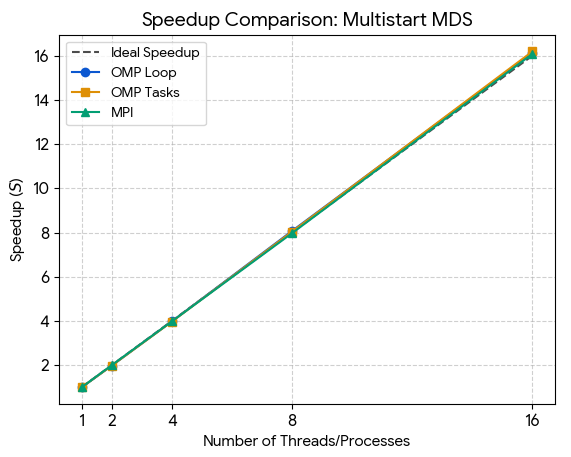
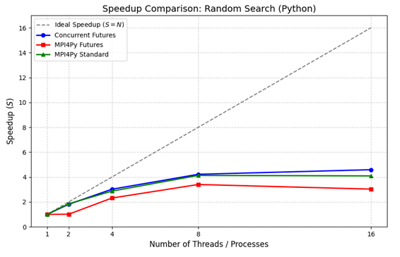
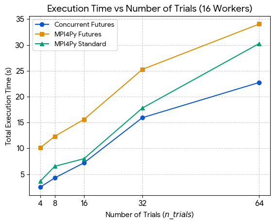
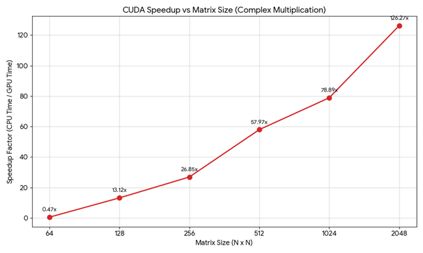
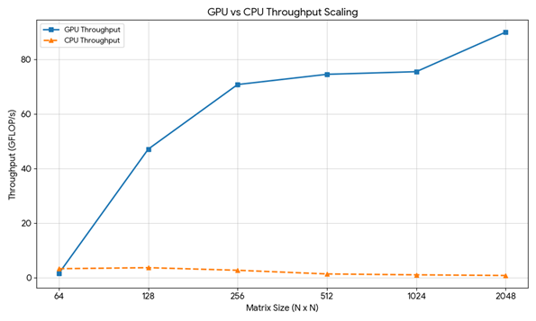
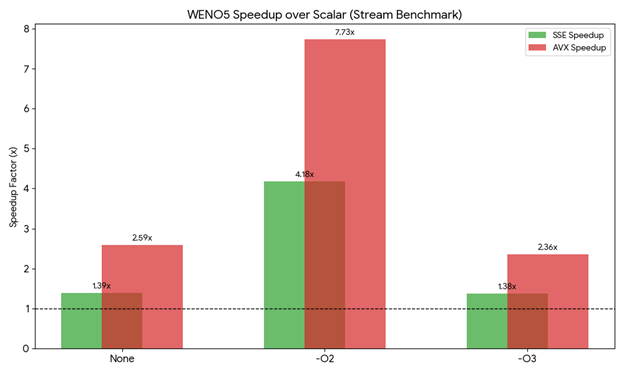
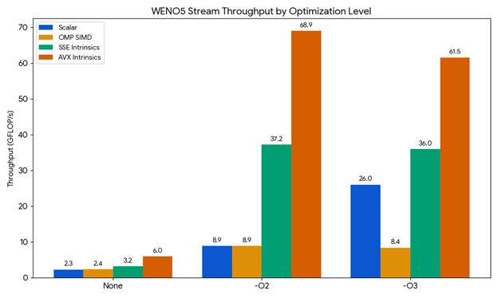

# HPC Exercises: Parallel Computing with OpenMP, MPI, SIMD, and CUDA

This repository contains exercises demonstrating parallel computing techniques including **OpenMP**, **MPI**, **SIMD vectorization (SSE/AVX)**, and **CUDA GPU programming**.

---

## Table of Contents

- [Exercise 1: Multistart Optimization (C/OpenMP/MPI)](#exercise-1-multistart-optimization)
- [Exercise 1: Random Search HPO (Python/MPI)](#exercise-1-random-search-hpo)
- [Exercise 2: Complex Matrix Multiplication (CUDA)](#exercise-2-complex-matrix-multiplication-cuda)
- [Exercise 2: WENO5 Stencil (SIMD)](#exercise-2-weno5-stencil-simd)
- [Performance Results](#performance-results)

---

## Exercise 1: Multistart Optimization

**Location:** `hpc_ex01_code/multistart/`

### Description

A **multistart optimization** algorithm using the **Multidirectional Search (MDS)** method to minimize the Rosenbrock "banana" function. The algorithm runs 64 independent trials from random starting points and selects the best result.

### Implementations

| File | Description |
|------|-------------|
| `multistart_mds_seq.c` | Sequential baseline implementation |
| `multistart_mds_omp.c` | Parallel with OpenMP `#pragma omp parallel for` |
| `multistart_mds_omp_tasks.c` | Parallel with OpenMP tasks (nested parallelism) |
| `multistart_mds_mpi.c` | Distributed parallelism with MPI |
| `torczon.c` | MDS (Torczon's method) local optimizer |

### Key Parallelization Techniques

- **OpenMP parallel for:** Distributes trials across threads with `#pragma omp parallel for`, uses `#pragma omp atomic` for function evaluation counter, and `#pragma omp critical` for updating the best solution
- **OpenMP tasks:** Creates tasks inside a `#pragma omp single` region, allowing dynamic scheduling with `#pragma omp taskwait` synchronization
- **MPI:** Divides trials evenly across processes, each process finds its local best, then `MPI_Reduce` aggregates function evaluations and `MPI_Send/MPI_Recv` gathers best solutions

### Build & Run

```bash
cd hpc_ex01_code/multistart
make all

# Sequential
./multistart_mds_seq

# OpenMP (set threads via OMP_NUM_THREADS)
export OMP_NUM_THREADS=8
./multistart_mds_omp
./multistart_mds_omp_tasks

# MPI
mpirun -np 8 ./multistart_mds_mpi
```

### Results Summary

| Implementation | Threads/Procs | Time (s) | Speedup |
|----------------|---------------|----------|---------|
| Sequential     | 1             | 109.3    | 1.00x   |
| OpenMP         | 2             | 55.1     | 1.98x   |
| OpenMP         | 4             | 27.5     | 3.98x   |
| OpenMP         | 8             | 13.5     | 8.09x   |
| OpenMP         | 16            | 6.8      | 16.08x  |
| OpenMP Tasks   | 16            | 6.8      | 16.07x  |
| MPI            | 16            | 6.8      | 16.08x  |

All implementations converge to the same optimal solution: `f(x) = 8.37e-03`



---

## Exercise 1: Random Search HPO

**Location:** `hpc_ex01_code/randomsearch/`

### Description

**Hyperparameter optimization (HPO)** for logistic regression using random search over the regularization parameter `C`. Trains on a 100,000-sample synthetic classification dataset.

### Implementations

| File | Description |
|------|-------------|
| `rs.py` | Sequential baseline |
| `rs_concurrent_futures.py` | Parallel with `ThreadPoolExecutor` |
| `rs_mpi4py_futures.py` | MPI parallelism with `mpi4py.futures.MPIPoolExecutor` |
| `rs_mpi4py.py` | MPI parallelism with `MPI.COMM_WORLD` (direct control) |

### Key Parallelization Techniques

- **ThreadPoolExecutor:** Python threads work well because scikit-learn releases the GIL during computation; threads share memory (zero-copy overhead)
- **MPIPoolExecutor:** Master-worker model; N-1 workers process tasks submitted by master
- **MPI.COMM_WORLD:** All N processes are workers; uses `broadcast`, `gather`, and round-robin distribution

### Build & Run

```bash
cd hpc_ex01_code/randomsearch

# Setup environment
conda create -n rs_env python
conda activate rs_env
pip install scikit-learn mpi4py

# Sequential
python rs.py

# ThreadPoolExecutor (uses all CPU cores)
python rs_concurrent_futures.py

# MPI (futures style)
mpiexec -n 8 python -m mpi4py.futures rs_mpi4py_futures.py

# MPI (direct COMM_WORLD)
mpiexec -n 8 python rs_mpi4py.py
```

### Results Summary

| Implementation | Workers | Time (s) | Speedup |
|----------------|---------|----------|---------|
| Sequential     | 1       | 70.3     | 1.00x   |
| ThreadPool     | 2       | 38.9     | 1.81x   |
| ThreadPool     | 4       | 23.3     | 3.02x   |
| ThreadPool     | 8       | 16.6     | 4.23x   |
| ThreadPool     | 16      | 15.3     | 4.59x   |
| MPI (direct)   | 8       | 17.0     | 4.13x   |
| MPI (futures)  | 8       | 20.7     | 3.40x   |

**Why ThreadPool outperforms MPI:**
- Threads share the dataset in memory (no serialization)
- MPI processes duplicate the ~150MB dataset per rank
- MPI has pickle/unpickle overhead for results




---

## Exercise 2: Complex Matrix Multiplication (CUDA)

**Location:** `hpc_ex02_code/cuda/`

### Description

Computes complex matrix multiplication:
- `E = A*C - B*D` (real part)
- `F = A*D + B*C` (imaginary part)

Where A+iB and C+iD are complex N×N matrices.

### Implementations

| File | Description |
|------|-------------|
| `complex_matrix_mul.cu` | Custom CUDA kernel |
| `complex_matrix_mul_cublas.cu` | Uses cuBLAS `cublasDgemm` for matrix products |

### Key Techniques

- **Custom kernel:** Each thread computes one element; straightforward implementation with coalesced memory access
- **cuBLAS version:** Computes 4 matrix multiplications (AC, BD, AD, BC) using optimized BLAS, then combines with element-wise kernels
- **Row-major to cuBLAS:** cuBLAS uses column-major, so computes `C^T * A^T = (A*C)^T` by swapping operands

### FLOP Count

```
4 matrix multiplications: 4 × 2N³ = 8N³
2 element-wise operations: 2N²
Total: 8N³ + 2N²
```

### Build & Run

```bash
cd hpc_ex02_code/cuda
make all

./complex_matrix_mul
./complex_matrix_mul_cublas
```

### Results Summary (N=1024)

| Metric | GPU | CPU | Speedup |
|--------|-----|-----|---------|
| Time   | 113.7 ms | 8971.3 ms | **78.9x** |
| Throughput | 75.6 GFLOP/s | 0.96 GFLOP/s | - |

| Matrix Size | Speedup |
|-------------|---------|
| 64×64       | 0.47x (CPU wins) |
| 128×128     | 13.1x   |
| 256×256     | 26.9x   |
| 512×512     | 58.0x   |
| 1024×1024   | 78.9x   |
| 2048×2048   | **126.3x** |

**Note:** For small matrices (N=64), CPU is faster due to GPU kernel launch overhead.




---

## Exercise 2: WENO5 Stencil (SIMD)

**Location:** `hpc_ex02_code/weno5/`

### Description

**WENO5 (Weighted Essentially Non-Oscillatory)** scheme with 5th-order accuracy, commonly used in computational fluid dynamics. The kernel computes smoothness indicators, nonlinear weights, and reconstruction polynomials.

**Computational intensity:** 78 FLOPs per element, 24 bytes memory traffic per element.

### Implementations

| Function | Description |
|----------|-------------|
| `weno_minus_reference()` | Scalar baseline |
| `weno_minus_vectorized()` | OpenMP SIMD (`#pragma omp simd`) |
| `weno_minus_sse()` | SSE intrinsics (128-bit, 4 floats) |
| `weno_minus_avx()` | AVX intrinsics (256-bit, 8 floats) |

### Key SIMD Techniques

- **SSE:** Uses `_mm_load_ps`, `_mm_mul_ps`, `_mm_add_ps`, `_mm_div_ps` for 4-wide SIMD
- **AVX:** Uses `_mm256_*` intrinsics for 8-wide SIMD
- **Memory alignment:** 32-byte aligned allocations with `posix_memalign`

### Benchmarks

Two benchmark modes:
1. **Peak-like (Cache):** ~92K elements fit in cache, measures compute throughput
2. **Stream-like:** ~19M elements exceed cache, measures memory bandwidth

### Build & Run

```bash
cd hpc_ex02_code/weno5
make
./bench
```

### Results Summary (O3 optimization)

**Peak-like benchmark (compute-bound):**

| Implementation | Time (s) | GFLOP/s | Speedup |
|----------------|----------|---------|---------|
| Scalar         | 0.0008   | 1978    | 1.0x    |
| OMP SIMD       | 0.173    | 9.0     | 0.005x  |
| SSE intrinsics | 0.040    | 38.6    | 4.3x    |
| AVX intrinsics | 0.021    | 75.0    | **8.3x** |

**Stream-like benchmark (memory-bound):**

| Implementation | Time (s) | GFLOP/s | GB/s  | Speedup |
|----------------|----------|---------|-------|---------|
| Scalar         | 0.170    | 26.4    | 8.1   | 1.0x    |
| OMP SIMD       | 0.519    | 8.6     | 2.7   | 0.33x   |
| SSE intrinsics | 0.124    | 36.1    | 11.1  | 1.4x    |
| AVX intrinsics | 0.071    | 62.9    | 19.4  | **2.4x** |

**Note:** The exceptionally high scalar "peak-like" throughput is due to aggressive compiler auto-vectorization at `-O3`. With `-O2` or no optimization, intrinsics show clear wins.




---

## Performance Results

### Summary

| Exercise | Best Parallel Speedup | Technique |
|----------|----------------------|-----------|
| Multistart MDS | 16x | OpenMP/MPI (embarrassingly parallel) |
| Random Search HPO | 4.6x | ThreadPoolExecutor |
| Complex MatMul | 126x | CUDA (2048×2048) |
| WENO5 Stencil | 8x | AVX intrinsics |

### Key Takeaways

1. **Embarrassingly parallel** workloads (independent trials) scale nearly linearly with thread/process count
2. **GPU acceleration** shows massive speedups for large, compute-intensive problems (but overhead hurts small problems)
3. **SIMD intrinsics** outperform compiler auto-vectorization for complex stencil operations
4. **Threading** often beats MPI for shared-memory workloads due to zero-copy data sharing
5. **Memory bandwidth** becomes the bottleneck for large datasets that exceed cache

---

## Requirements

### C/C++ (multistart, WENO5)
- GCC with OpenMP support (`-fopenmp`)
- MPI implementation (OpenMPI, MPICH)
- AVX-capable CPU for WENO5 intrinsics

### CUDA
- NVIDIA GPU with compute capability 3.0+
- CUDA Toolkit (nvcc, cuBLAS)

### Python (random search)
- Python 3.x
- scikit-learn
- mpi4py (for MPI versions)

---

## License

Educational exercises for parallel computing courses.

